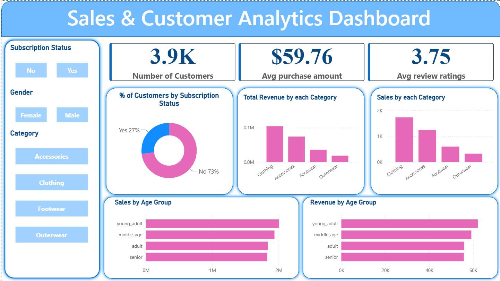

# 📊 Sales & Customer Analytics Dashboard

## 📌 Project Overview
This project provides an end-to-end exploratory data analysis (EDA) and business intelligence dashboard analyzing transactional sales data. It evaluates key metrics including monthly revenue trends, product category performance, and customer segmentation to drive actionable business decisions.

---

## 🛠️ Tech Stack & Tools Used
* **Data Processing & Cleaning:** Python (Pandas, NumPy)
* **Database & Querying:** SQL (Aggregations, GROUP BY, JOINs)
* **Visualization & BI:** Power BI / MS-Excel
* **Documentation & Version Control:** Git, GitHub

---

## 📊 Dashboard Preview
///#

---

## 🔍 Key Analytical Insights & Findings
* **Revenue Trends:** Identified peak sales periods and month-over-month growth patterns.
* **Category Performance:** Evaluated top-performing vs. underperforming product categories.
* **Customer Segmentation:** Analyzed regional customer distribution and average order values (AOV).

---

## 📁 Repository Structure
├── data_cleaning.py      # Python script for data preprocessing & EDA
├── sales_queries.sql     # SQL queries for trend analysis & aggregations
├── sales_dashboard.pbix  # Power BI dashboard file
└── README.md             # Project documentation
